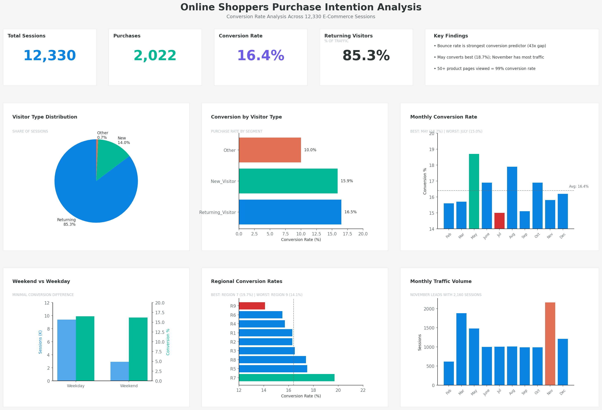
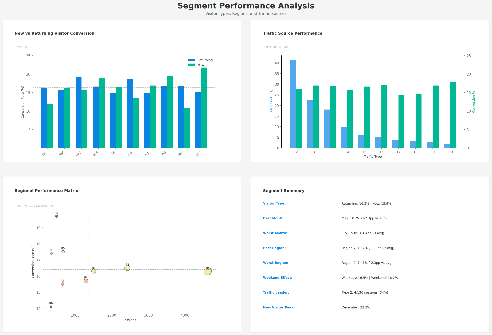

# Online Shoppers Purchase Intention Analysis

## Project Background

E-commerce companies invest heavily in driving traffic to their websites, but what really matters in terms of generating revenue is conversion: turning browsers into buyers. This analysis looks at 12,330 online shopping sessions to understand what separates visitors who purchase from those who leave empty-handed.

The dataset captures user behavior across an e-commerce platform, tracking page visits, time spent browsing, bounce rates, and whether each session ended in a purchase. By identifying patterns in how buyers behave differently from non-buyers, the business can focus its optimization efforts where they'll have the most impact.

*This project was conducted in October 2025 and later uploaded to GitHub in January 2026.*

**Key business questions addressed:**
- What is the overall conversion rate, and how does it vary by visitor segment?
- Which months and traffic sources drive highest-converting sessions?
- How does browsing behavior (pages viewed, time on site, bounce rate) relate to likelihood of purchase?
- Are there specific visitor profiles that warrant targeted attention?

**Dataset Information**

**Source:** [Online Shoppers Purchasing Intention Dataset - UCI ML Repository](https://archive.ics.uci.edu/dataset/468/online+shoppers+purchasing+intention+dataset)

**Provider:** UCI Machine Learning Repository

SQL queries for inspection and analysis: [Inspection Queries](sql/01_data_inspection.sql), [Analysis Queries](sql/02_analysis_queries.sql)

---

## Data Structure

The dataset contains 12,330 sessions with 18 attributes covering page visits, engagement metrics, traffic sources, and user characteristics.

### Entity Relationship Diagram

```
┌─────────────────────────────────────────────────────────────────────────────┐
│                              SESSIONS                                        │
├─────────────────────────────────────────────────────────────────────────────┤
│  PAGE METRICS                                                                │
│  ─────────────                                                               │
│  Administrative           INTEGER     Admin pages viewed                     │
│  Administrative_Duration  FLOAT       Time on admin pages (seconds)          │
│  Informational            INTEGER     Info pages viewed                      │
│  Informational_Duration   FLOAT       Time on info pages (seconds)           │
│  ProductRelated           INTEGER     Product pages viewed                   │
│  ProductRelated_Duration  FLOAT       Time on product pages (seconds)        │
│                                                                              │
│  ENGAGEMENT METRICS                                                          │
│  ──────────────────                                                          │
│  BounceRates              FLOAT       % of single-page sessions              │
│  ExitRates                FLOAT       % of exits from pages viewed           │
│  PageValues               FLOAT       Avg value of pages before purchase     │
│                                                                              │
│  SESSION CONTEXT                                                             │
│  ───────────────                                                             │
│  SpecialDay               FLOAT       Proximity to special day (0-1)         │
│  Month                    TEXT        Month of session                       │
│  Weekend                  BOOLEAN     Weekend session flag                   │
│                                                                              │
│  USER & TRAFFIC                                                              │
│  ──────────────                                                              │
│  OperatingSystems         INTEGER     OS identifier                          │
│  Browser                  INTEGER     Browser identifier                     │
│  Region                   INTEGER     Geographic region                      │
│  TrafficType              INTEGER     Traffic source identifier              │
│  VisitorType              TEXT        New, Returning, or Other               │
│                                                                              │
│  TARGET VARIABLE                                                             │
│  ───────────────                                                             │
│  Revenue                  BOOLEAN     Purchase made (TRUE/FALSE)             │
├─────────────────────────────────────────────────────────────────────────────┤
│  Records: 12,330 sessions                                                    │
└─────────────────────────────────────────────────────────────────────────────┘
```

### Data Dictionary

| Column | Description | Type |
|--------|-------------|------|
| `Administrative` | Number of admin pages visited | INTEGER |
| `Administrative_Duration` | Time spent on admin pages (seconds) | FLOAT |
| `Informational` | Number of informational pages visited | INTEGER |
| `Informational_Duration` | Time spent on info pages (seconds) | FLOAT |
| `ProductRelated` | Number of product pages visited | INTEGER |
| `ProductRelated_Duration` | Time spent on product pages (seconds) | FLOAT |
| `BounceRates` | Average bounce rate of pages visited | FLOAT |
| `ExitRates` | Average exit rate of pages visited | FLOAT |
| `PageValues` | Average page value of pages visited | FLOAT |
| `SpecialDay` | Closeness to a special day (0 to 1) | FLOAT |
| `Month` | Month of the session | TEXT |
| `OperatingSystems` | Operating system identifier | INTEGER |
| `Browser` | Browser identifier | INTEGER |
| `Region` | Geographic region identifier | INTEGER |
| `TrafficType` | Traffic source identifier | INTEGER |
| `VisitorType` | New, Returning, or Other | TEXT |
| `Weekend` | Whether session occurred on weekend | BOOLEAN |
| `Revenue` | Whether session resulted in purchase | BOOLEAN |

---

## Executive Summary

### Overview

About 16.4% of sessions convert into purchases. This figure provides a baseline, but the real story lies within the variation across visitor segments and behaviors. Bounce rate stands out as the strongest predictor: sessions with bounce rates under 2% convert at 69%, compared to just 1.6% for sessions with bounce rates above 10%.

Returning visitors make up 85% of traffic and convert slightly better than new visitors (16.5% vs 15.9%). May and November have the highest traffic, but May has highest conversion at 18.7%. Browsing intensity matters too: visitors who view 50+ product pages convert at nearly 100%, while those viewing fewer than 30 pages rarely buy.

### Key Metrics

| Metric | Value |
|--------|-------|
| Total Sessions | 12,330 |
| Purchases | 2,022 |
| Conversion Rate | 16.4% |
| Returning Visitor Share | 85.3% |
| Best Converting Month | May (18.7%) |
| Worst Converting Month | July (15.0%) |



---

## Insights Deep Dive

### 1. Bounce Rate: The Strongest Conversion Signal

Bounce rate shows a dramatic relationship with purchase likelihood. Sessions with very low bounce rates convert at 43 times the rate of high-bounce sessions.

| Bounce Rate Tier | Sessions | Conversion Rate |
|------------------|----------|-----------------|
| Very Low (<2%) | 1,324 | 68.9% |
| Low (2-5%) | 2,208 | 29.9% |
| Medium (5-10%) | 3,396 | 10.8% |
| High (>10%) | 5,402 | 1.6% |

High-bounce sessions account for 44% of all traffic but contribute only 1.6% conversion. This likely points to either poor traffic quality from certain sources or friction early in the user journey that causes visitors to leave before engaging.

**Suggestion:** Reducing bounce rates should be a top priority. Even moving sessions from the "High" tier to "Medium" would triple their conversion likelihood.

---

### 2. Browsing Intensity Drives Purchases

Visitors who view more product pages are far more likely to buy. Those viewing 50+ product pages convert at nearly 100%, while moderate browsers (10-30 pages) convert at just 0.3%.

| Browsing Intensity | Sessions | Conversion Rate |
|--------------------|----------|-----------------|
| Moderate (10-30 pages) | 6,381 | 0.3% |
| Heavy (30-50 pages) | 5,590 | 29.5% |
| Very Heavy (50+ pages) | 359 | 99.4% |

Buyers view an average of 44 product pages versus 28 for non-buyers. They also spend nearly twice as long browsing (1,912 seconds vs 991 seconds).

**Suggestion:** Features that encourage deeper browsing, such as related product recommendations, comparison tools or wish lists, could push moderate browsers into higher-converting segments.


---

### 3. Returning Visitors: High Volume, Modest Edge

Returning visitors dominate traffic at 85% of sessions and convert slightly better than new visitors (16.5% vs 15.9%). The gap is smaller than might be expected.

| Visitor Type | Sessions | Share | Conversion Rate |
|--------------|----------|-------|-----------------|
| Returning | 10,513 | 85.3% | 16.5% |
| New | 1,727 | 14.0% | 15.9% |
| Other | 90 | 0.7% | 10.0% |

New visitors in December convert at 22.2%, the highest of any month-visitor combination. This likely reflects holiday gift shopping from first-time visitors who arrive with purchase intent.

**Suggestion:** The small gap between new and returning visitors suggests the site might not be fully capitalizing on returning visitor familiarity. Personalization based on browsing history could widen this gap.

---

### 4. Monthly Patterns: May Leads, November Lags

November is the busiest month with 2,160 sessions, but converts below average at 15.8%. May, with 1,482 sessions, leads at 18.7%.

| Month | Sessions | Purchases | Conversion Rate |
|-------|----------|-----------|-----------------|
| May | 1,482 | 277 | 18.7% |
| August | 1,009 | 181 | 17.9% |
| October | 986 | 167 | 16.9% |
| November | 2,160 | 342 | 15.8% |
| March | 1,880 | 296 | 15.7% |

November's high traffic but lower conversion may indicate more casual browsing during holiday season, with visitors comparing options across multiple sites before committing.

**Suggestion:** November needs conversion optimization despite strong traffic. Features like urgency messaging, limited-time offers, or simplified checkout could help capture undecided holiday shoppers.

---

### 5. Weekend vs Weekday: Minimal Difference

Weekend and weekday sessions convert at nearly identical rates (16.2% vs 16.5%), though weekdays account for 76% of traffic.

| Day Type | Sessions | Conversion Rate |
|----------|----------|-----------------|
| Weekday | 9,401 | 16.5% |
| Weekend | 2,929 | 16.2% |

The lack of weekend lift suggests visitors aren't necessarily more purchase-ready when they have leisure time. Weekend visitors may simply be more casual browsers.

**Suggestion:** Marketing spend doesn't need to favor weekends. Focus instead on reaching visitors when they're in buying mode, regardless of day.

---

### 6. Regional Variation

Region 7, despite smaller volume, converts at 19.7%, the highest among regions with meaningful traffic. Region 9 trails at 14.1%.

| Region | Sessions | Conversion Rate |
|--------|----------|-----------------|
| Region 7 | 487 | 19.7% |
| Region 5 | 664 | 17.5% |
| Region 8 | 351 | 17.4% |
| Region 1 | 4,626 | 16.3% |
| Region 9 | 333 | 14.1% |

Region 1 drives 38% of traffic but converts at the overall average. The 5.6 percentage point gap between best and worst regions points to either audience differences or specific experience issues.

**Suggestion:** Investigate what's working in Region 7. If the high conversion reflects audience quality, consider increasing marketing spend there. If it's a site experience difference, apply those lessons elsewhere.



---

## Recommendations

### 1. Prioritize Bounce Rate Reduction

With 44% of sessions bouncing at rates above 10% and converting at just 1.6%, this is the highest-leverage opportunity. Actions to consider:
- Audit landing pages for the highest-bounce traffic sources
- Speed up page load times
- Test clearer value propositions above the fold
- Add exit-intent offers for first-time visitors

### 2. Encourage Deeper Product Browsing

Sessions with 30+ product page views convert at 30%, versus near-zero for lighter browsers. Consider:
- Enhanced "related products" and "customers also viewed" features
- Product comparison tools
- Wish list functionality with email reminders
- Category landing pages that showcase breadth

### 3. Optimize November for Conversion

November brings the most traffic but converts below average. For the holiday season:
- Add urgency elements (countdown timers, stock indicators)
- Simplify checkout to reduce abandonment
- Offer price-match guarantees to reduce comparison shopping
- Retarget November browsers with December campaigns

### 4. Investigate Regional Differences

Region 7's 19.7% conversion rate versus Region 9's 14.1% warrants attention:
- Compare traffic sources and landing pages by region
- Check for localization issues (currency, shipping, language)
- Analyze product preferences by region
- Consider region-specific promotions in high-converting areas

### 5. Develop New Visitor Conversion Path

New visitors convert nearly as well as returning visitors, but this gap should be wider. Consider:
- First-purchase discounts or free shipping thresholds
- Email capture with browse abandonment sequences
- Personalized recommendations based on entry page and browsing

---

## Technical Implementation

### SQL Queries Reference

The analysis was conducted using MySQL with the following query categories:

| Query Type | Purpose | Example |
|------------|---------|---------|
| Aggregation | Conversion rates, averages | `AVG()`, `COUNT()`, `GROUP BY` |
| Conditional Logic | Segment categorization | `CASE WHEN BounceRates < 0.02 THEN...` |
| Subqueries | Baseline comparisons | `(SELECT COUNT(*) FROM sessions)` |
| Percentage Calculations | Share of traffic, conversion rates | `100.0 * SUM(...) / COUNT(*)` |
| Filtering | Visitor type, month analysis | `WHERE VisitorType IN (...)` |

### Repository Structure

```
├── README.md
├── sql/
│   ├── 01_data_inspection.sql
│   └── 02_analysis_queries.sql
└── visualizations/
    ├── 03_executive_dashboard.png
    ├── 04_conversion_analysis.png
    └── 05_segment_analysis.png
```

---

## Limitations

- Data covers a single time period; seasonal patterns would benefit from multi-year comparison.
- Traffic source and region identifiers are anonymous, limiting actionable specificity.
- No revenue amounts, only purchase yes/no, so high-value customer analysis isn't possible.
- Browser and OS identifiers don't map to names, limiting device optimization insights.
___
